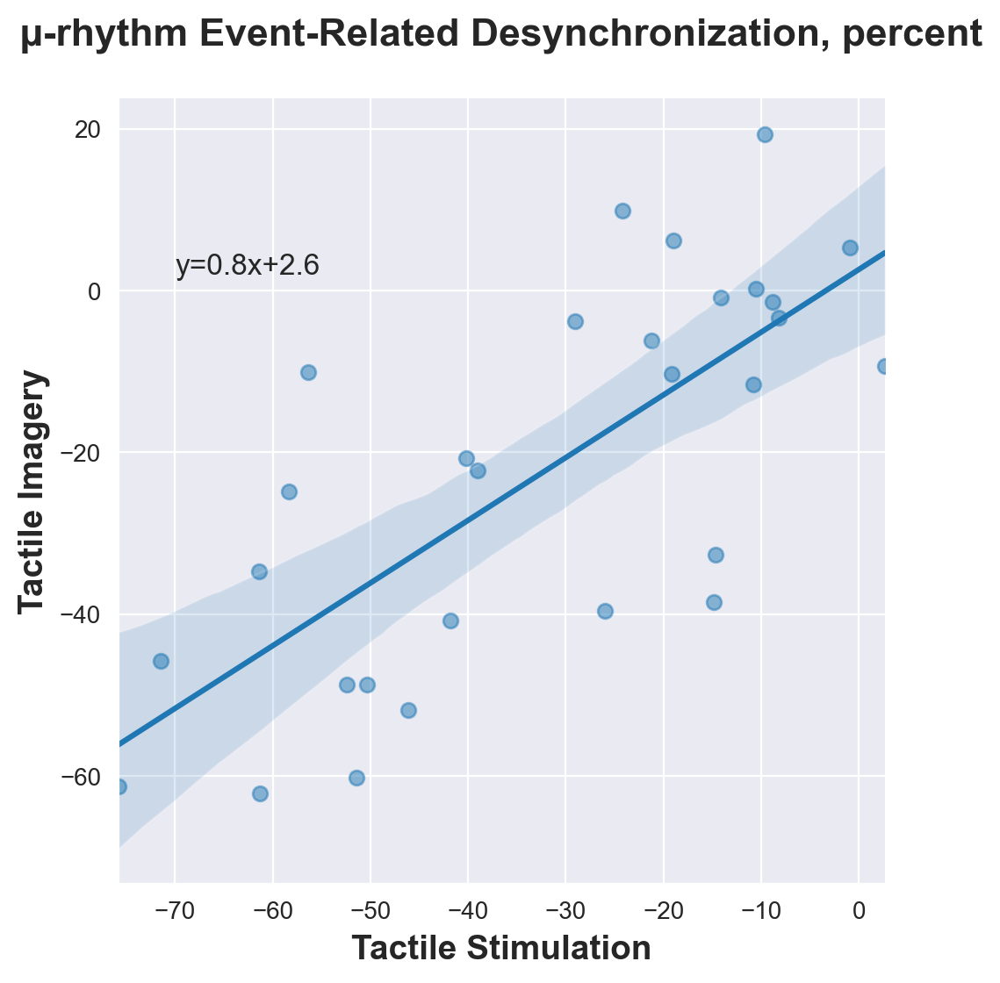
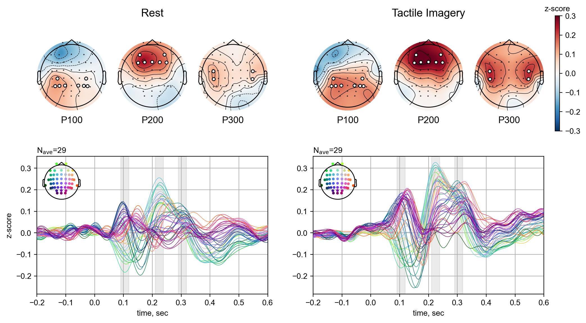
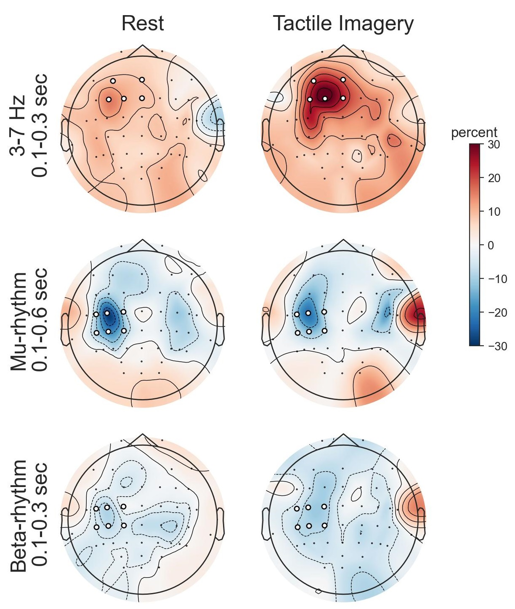

# Tactile Imagery
This repository contains notebooks and data to generate final figures. The aim of the study is to investigate the modulatory effects of mental tactile imagery on somatosensory processing.

## Repository Structure
- [figs folder](https://github.com/MarkaMorozova/Tactile-Imagery/tree/main/figs) and [dfs folder](https://github.com/MarkaMorozova/Tactile-Imagery/tree/main/dfs): contains main figures from the notebooks and data to connect notebooks [1](https://github.com/MarkaMorozova/Tactile-Imagery/blob/main/1.%208-sec%20tactile%20stimulation%26imagery.ipynb), [2](https://github.com/MarkaMorozova/Tactile-Imagery/blob/main/2.%20somatosensory%20ERP%20rest%26imagery.ipynb), [3](https://github.com/MarkaMorozova/Tactile-Imagery/blob/main/3.%20ERD%20to%20short%20tactile%20stimuli%20rest%26imagery.ipynb) with each other

- [vibro_script](https://github.com/MarkaMorozova/Tactile-Imagery/blob/main/vibro_script.ipynb): notebook with experimental script to run collect data from participants
- [brief_analysis](https://github.com/MarkaMorozova/Tactile-Imagery/blob/main/brief_analysis.ipynb): notebook with brief analysis of the experimental data; we used it during the experiment to briefly watch at mu-rhythm ERD or ERP, show to the participants, engage them and correct smth

- [1. 8-sec tactile stimulation&imagery.ipynb](https://github.com/MarkaMorozova/Tactile-Imagery/blob/main/1.%208-sec%20tactile%20stimulation%26imagery.ipynb): notebook to analyze Event-Related Desynchronizations (ERD) in response to 8-second Tactile Stimulation (TS) and Tactile Imagery (TI) epochs (learning of TI)
- [2. somatosensory ERP rest&imagery.ipynb](https://github.com/MarkaMorozova/Tactile-Imagery/blob/main/2.%20somatosensory%20ERP%20rest%26imagery.ipynb): notebook to analyze Event-Related Potentials (ERP) in response to 75 ms vibrational stimuli during Rest and TI
- [3. ERD to short tactile stimuli rest&imagery.ipynb](https://github.com/MarkaMorozova/Tactile-Imagery/blob/main/3.%20ERD%20to%20short%20tactile%20stimuli%20rest%26imagery.ipynb): notebook to analyze Event-Related Desynchronizations and Synchronizations (ERD and ERS) in response to 75 ms vibrational stimuli during Rest and TI

## How to use repository
- download zip-archive with the preprocessed data [here](https://drive.google.com/file/d/1NXV7dYO2dlHMTA_AOzInS16sbDLL1QZz/view?usp=sharing) 

- download/clone this repository

- unzip archive with the preprocessed data, place the folder `preprocessed_data` in the same folder as notebooks

- run the notebooks

## Main findings
### 1. Mu-rhythm ERD during TS correlates with mu-rhythm ERD during TI

 

### 2. ERP to 75 ms vibrational stimuli consist of 3 main components P100, P200, P300

 

### 3. TI modulates ERP to 75 ms vibrational stimuli, particularly, P100 in ipsilateral hemisphere, P200 in frontal region and P300 in contra- and ipsilateral hemispheres

 

### 4. Event-Related Time-Frequency changes to 75 ms vibrational stimuli consist of ERS in theta-frequency range and ERD in mu- and beta-frequency ranges, and ERS in theta-frequency range statistically significantly increases during TI

